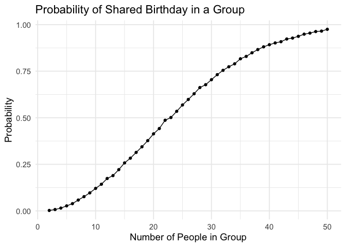
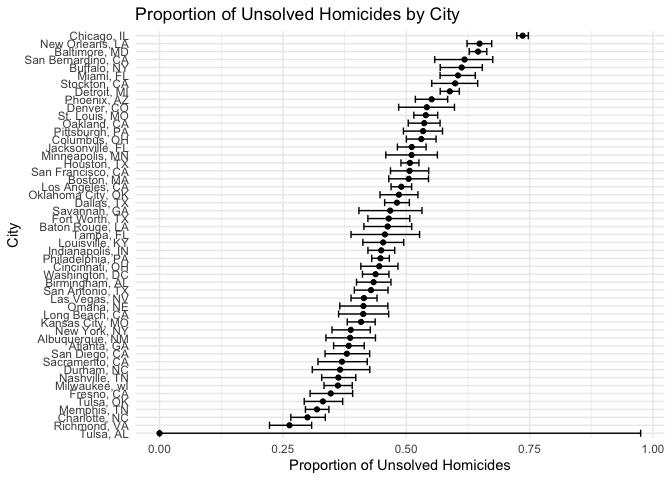

p8105_hw5_yz4993
================
Yixin Zheng
2024-11-15

\#Problem 1

``` r
simulate_birthday <- function(n) {
  birthdays <- sample(1:365, n, replace = TRUE) # assign random birthdays
  any(duplicated(birthdays)) # check for duplicate birthdays
  }
```

``` r
set.seed(42)
sizes <- 2:50
num_of_times_1 <- 10000
```

``` r
p1_results <- tibble(
  group_size = sizes,
  probability = map_dbl(sizes, 
                        function(n) {
                          mean(replicate(num_of_times_1,
                                         simulate_birthday(n)))
                          })
  )

# another method:
# sim_results_df <- expand_grid(group_size = 2:50, iter = 1:10000) |> mutate(has_shared_birthday = map_lgl(group_size, simulate_birthday)) |> group_by(group_size) |> summarize(probability = mean(has_shared_birthday), .groups = "drop")
```

``` r
p1_results %>%
  ggplot(aes(x = group_size, y = probability)) +
  geom_line() +
  geom_point() +
  labs(
    title = "Probability of Shared Birthday in a Group",
    x = "Number of People in Group",
    y = "Probability"
    ) +
  theme_minimal(base_size = 14)
```

<!-- -->

The plot above shows that as the group size increases, the probability
of that at least two people in the group will share a birthday also
increase. Around group size of 23,the probability exceeds 0.5(50%), and
in group of 50 people, the probability is very close to 1(100%). Meaning

# Problem 2

``` r
n <- 30
sigma <- 5
num_of_times_2 <- 5000
mu_values <- c(1, 2, 3, 4, 5, 6)
```

``` r
t_test <- function(mu) {
  x <- rnorm(n, mean = mu, sd = sigma)
  t_test_result <- t.test(x, mu = 0)
  tidy(t_test_result) %>% 
    select(estimate, p.value)
}
```

``` r
set.seed(42)
mu0_results <- tibble(
  iter = 1:num_of_times_2,
  test_result = map(iter, ~ t_test(mu = 0))
  ) %>%
  unnest(test_result)
```

``` r
mu0_power <- mean(mu0_results$p.value < 0.05)
mu0_power
```

    ## [1] 0.0516

``` r
mu_value_results <- expand_grid(
  mu = mu_values,
  iter = 1:num_of_times_2
  ) %>%
  mutate(
    test_result = map(mu, ~ t_test(.x))
    ) %>%
  unnest(test_result)
```

``` r
mu_values_power <- mu_value_results %>%
  group_by(mu) %>%
  summarize(power = mean(p.value < 0.05), 
            .groups = "drop")
mu_values_power
```

    ## # A tibble: 6 × 2
    ##      mu power
    ##   <dbl> <dbl>
    ## 1     1 0.180
    ## 2     2 0.573
    ## 3     3 0.889
    ## 4     4 0.988
    ## 5     5 1.00 
    ## 6     6 1

``` r
# combine mu = 0 result with other power results
power_results <- bind_rows(
  tibble(mu = 0, power = mu0_power),
  mu_values_power
)
power_results
```

    ## # A tibble: 7 × 2
    ##      mu  power
    ##   <dbl>  <dbl>
    ## 1     0 0.0516
    ## 2     1 0.180 
    ## 3     2 0.573 
    ## 4     3 0.889 
    ## 5     4 0.988 
    ## 6     5 1.00  
    ## 7     6 1

``` r
power_plot <- power_results %>%
  ggplot(aes(x = mu, y = power)) +
  geom_line() +
  geom_point() +
  labs(
    title = "Power of the Test vs. True Value of mu",
    x = "True Value of mu",
    y = "Power"
  ) +
  theme_minimal(base_size = 14)
power_plot
```

<!-- --> The
plot above shows a positive association between effect size and the
power of the test. As the true value of mu increases, the power of the
test also increases.

``` r
avg_estimates <- mu_value_results %>%
  group_by(mu) %>%
  summarize(
    avg_mu_hat_alltest = mean(estimate),
    avg_mu_hat_rejected = mean(estimate[p.value < 0.05]),
    .groups = "drop"
  )

avg_mu_0 <- tibble(
  mu = 0,
  avg_mu_hat_alltest = mean(mu0_results$estimate),
  avg_mu_hat_rejected = mean(mu0_results$estimate[mu0_results$p.value < 0.05])
)

avg_estimates <- bind_rows(avg_mu_0, avg_estimates)
```

``` r
estimate_plot <- avg_estimates %>%
  ggplot(aes(x = mu)) +
  geom_line(aes(y = avg_mu_hat_alltest, color = "All Tests")) +
  geom_line(aes(y = avg_mu_hat_rejected, color = "Rejected Nulls")) +
  geom_point(aes(y = avg_mu_hat_alltest, color = "All Tests")) +
  geom_point(aes(y = avg_mu_hat_rejected, color = "Rejected Nulls")) +
  labs(
    title = "Average Estimate of hat(Mu) by True Values of Mu",
    x = "True Values of Mu",
    y = "Average Estimate of hat(Mu)",
    color = "Group"
  ) +
  theme_minimal(base_size = 14)

estimate_plot
```

<!-- -->

The sample average of hat(mu) across tests for which the null is
rejected is not approximately equal to the true value of mu, especially
at lower values of mu but it becomes closer as mu increases. Because
when we are only considering hat(mu) in samples for which the null was
rejected, it will be more likely to include tests with estimates of
larger effect because that would pass the alpha = 0.05, and thus would
tend to results in a slight overestimate in smaller values of the true
mean, but the we will have better approximation at larger values.

# Problem 3

``` r
file_path <- "~/Desktop/Data Science/HW/HW5/p8105_hw5_yz4993/data/homicide-data.csv"
homicide_data <- read_csv(file_path)
```

    ## Rows: 52179 Columns: 12
    ## ── Column specification ────────────────────────────────────────────────────────
    ## Delimiter: ","
    ## chr (9): uid, victim_last, victim_first, victim_race, victim_age, victim_sex...
    ## dbl (3): reported_date, lat, lon
    ## 
    ## ℹ Use `spec()` to retrieve the full column specification for this data.
    ## ℹ Specify the column types or set `show_col_types = FALSE` to quiet this message.

The Washington Post homicide dataset has 52,179 records with 12
variables, showcasing homicides in 50 U.S. cities. This dataset includes
victim demographics such as race, age, sex and case status + information
such as uid and reported date, and location information such as
latitude, longitude, city and state.

``` r
homicide_summary <- homicide_data %>%
  mutate(city_state = str_c(city, ", ", state)) %>%
  group_by(city_state) %>%
  summarize(
    total_homicides = n(),
    unsolved_homicides = sum(disposition %in% 
                               c("Closed without arrest", "Open/No arrest")),
    .groups = "drop"
  )
```

``` r
balMD_data <- homicide_summary %>%
  filter(city_state == "Baltimore, MD")

balMD_test <- prop.test(
  x = balMD_data$unsolved_homicides,
  n = balMD_data$total_homicides
)

balMD_summary <- broom::tidy(balMD_test) %>%
  select(estimate, conf.low, conf.high)
balMD_summary
```

    ## # A tibble: 1 × 3
    ##   estimate conf.low conf.high
    ##      <dbl>    <dbl>     <dbl>
    ## 1    0.646    0.628     0.663

``` r
prop_test <- function(unsolved, total) {
  if (total < 10) { 
    prop_test_result <- binom.test(x = unsolved, n = total)
    broom::tidy(prop_test_result) %>%
      select(estimate, conf.low, conf.high)
  } else {
    prop_test_result <- prop.test(x = unsolved, n = total)
    broom::tidy(prop_test_result) %>%
      select(estimate, conf.low, conf.high)
  }
}

city_estimates <- homicide_summary %>%
  mutate(
    test_results = map2(unsolved_homicides, total_homicides, prop_test)
  ) %>%
  unnest(test_results)

city_estimates
```

    ## # A tibble: 51 × 6
    ##    city_state     total_homicides unsolved_homicides estimate conf.low conf.high
    ##    <chr>                    <int>              <int>    <dbl>    <dbl>     <dbl>
    ##  1 Albuquerque, …             378                146    0.386    0.337     0.438
    ##  2 Atlanta, GA                973                373    0.383    0.353     0.415
    ##  3 Baltimore, MD             2827               1825    0.646    0.628     0.663
    ##  4 Baton Rouge, …             424                196    0.462    0.414     0.511
    ##  5 Birmingham, AL             800                347    0.434    0.399     0.469
    ##  6 Boston, MA                 614                310    0.505    0.465     0.545
    ##  7 Buffalo, NY                521                319    0.612    0.569     0.654
    ##  8 Charlotte, NC              687                206    0.300    0.266     0.336
    ##  9 Chicago, IL               5535               4073    0.736    0.724     0.747
    ## 10 Cincinnati, OH             694                309    0.445    0.408     0.483
    ## # ℹ 41 more rows

``` r
city_estimates %>%
  arrange(estimate) %>%
  mutate(city_state = factor(city_state, levels = unique(city_state))) %>%
  ggplot(aes(x = city_state, y = estimate)) +
  geom_point() +
  geom_errorbar(aes(ymin = conf.low, ymax = conf.high)) +
  coord_flip() +
  labs(
    title = "Proportion of Unsolved Homicides by City",
    x = "City",
    y = "Proportion of Unsolved Homicides"
  ) +
  theme_minimal()
```

<!-- -->
